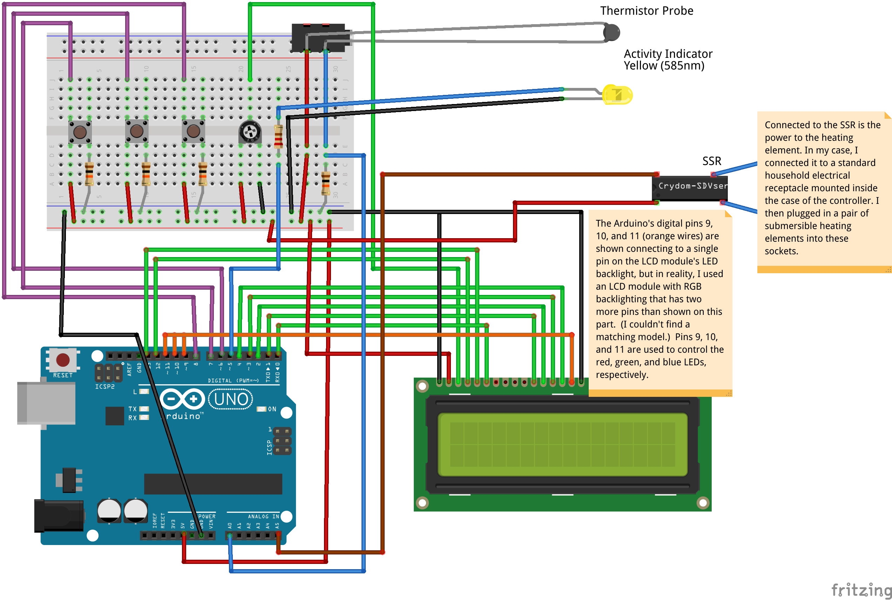

# Thermal Controller for an Arduino-powered sous vide oven

## What's a sous-vide oven?

[Sous-vide](https://en.wikipedia.org/wiki/Sous-vide) is a method of cooking wherein the food is immersed in a water bath with tightly controlled temperature.  The water bath is set to the temperature at which the food would be cooked.  For example, a perfect medium rare steak is 135F, so you set your sous-vide oven to that temperature.  In an hour or so, the entire steak will reach a uniform 135F.  You could leave it in there for hours and it would never become overcooked because it cannot exceed the temperature of the water.

## Hardware

This is not a step-by-step guide to constructing your own.  I did not go out of my way to construct a very nice enclosure for this because I was more interested in the electronics aspect of it.  However, you could use this wiring diagram to build the guts and put it into a nicer enclosure of your own design.

In addition to the electronics and the enclosure for them, you will need the following:

- High temperature water pump to circulate the water
- Submersible heating element (I use cheap beverage immersion heaters)
- Something waterproof to hold them (I used a metal mesh pencil cup).
- Cooking vessel (I recommend using an insulated cooler as that will make the oven much more energy efficient than a normal pot.)

If there is enough interest, I'll update this with a more detailed bill of materials.

#### Pictures are worth a few thousand words

To give a better idea of how the enclosure was constructed and how the finished product is used, take a look at this 
[gallery of photos taken throughout its construction](https://goo.gl/photos/XpjmAeLDSBSUWQet9).

## Software

The software in this repository was designed for use on an Arduino Uno, but would probably work on any other Arduino microcontrollers with the requisite GPIO and analog pins.  It is used to run the user interface (buttons and LCD screen) as well as manage the temperature of the water bath.

## Usage

The interface is pretty simple.  The three buttons shown in the diagram are used to control the system.  The middle button is used to cycle through different modes:

- **Set target temperature**: Use the left and right buttons to set the target temperature.
- **Set temperature threshold**: Use the left and right buttons to set the amount that the temperature can deviate from the target temperature for the purpose of hysteresis.
- **Set units**: Select between Celsius and Fahrenheit.
- **Thermometer/Timer**: Displays the water temperature and a timer without activating the heater.  Press and hold the left and right buttons simultaneously to reset the timer.
- **Temperature Control**: Activates temperature control.  The heater will not turn on in any other mode.  The display shows the following pieces of information:
  - **S**: Set temperature (aka the target temperature), adjustable using the left and right buttons
  - **P**: Process temperature (aka the actual current temperature)
  - **T**: Total cooking time
  - **H**: Total amount of time that the heater has been turned on
Press and hold the left and right buttons simultaneously to reset both T and H timers.

